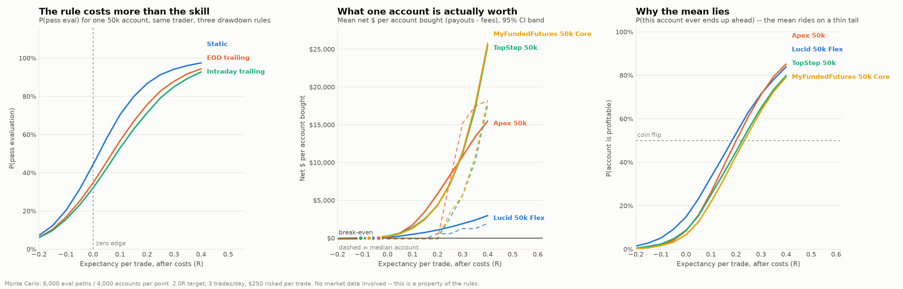

# propfirm-lab

Prop-firm account mathematics. It answers one question in dollars:

> **How much edge do you need before buying a prop-firm account is worth doing?**

It answers it *before* touching any market data, because the answer does not
depend on any. A prop-firm account is a path-dependent lottery ticket with
rules, and how much that ticket is worth is a property of the rules plus the
shape of your P&L path. Both are fully specified before a price series is
involved.

## Why this exists

Two earlier research labs in this account never produced a single real result,
both for the same reason: they put "buy 15 years of market data" on the
critical path and stopped there. This one is built so the most valuable part
needs no data at all.

## The headline result



Reproduce with `python run_edge_curve.py`. Full write-up in
[`findings/01_edge_requirement.md`](findings/01_edge_requirement.md).

Three things fall out, none of which needed a price series:

**1. The rule costs more than the skill.** Same trader, zero edge, one 50k
account, only the drawdown rule changes:

| Drawdown rule | P(pass eval) |
|---|---|
| Static | 44.2% |
| EOD trailing | 34.6% |
| Intraday trailing (Apex default) | 31.9% |

12.3 points of pass rate, bought and paid for with nothing but the account
you chose. The static number matches the gambler's-ruin closed form
`D/(D+T)` = 2500/5500 = 45.5%, which is how we know the simulator is right
rather than merely plausible.

**2. The mean is a liar.** At zero after-cost expectancy on Apex 50k, the mean
net is **+$134 per account** — and **91.7% of accounts still lose their fee.**
The positive mean rides on a 1.5% tail that grinds out 3–6 payouts. The median
account loses exactly the entry fee, and keeps losing exactly the entry fee all
the way up to +0.2R.

**3. So there are two break-even edges, and they differ by five times.**

| What you want | Edge required (after costs) |
|---|---|
| Positive **mean** across many accounts | **−0.036R** (Apex) |
| Positive **median** — a typical account profits | **+0.201R** |

If the goal is *stable* profit rather than lottery-mean profit, the second
number is the target. That is the bar any strategy in `research/` has to clear.

## Layout

```
rules/      executable rulesets (Apex / TopStep / MFFU), each with effective_date
sim/        the account simulator: equity path in, life and death out
paths/      P&L path generators, parameterized in R and expectancy
research/   the edge layer -- needs market data, not built yet
portfolio/  multi-account math -- not built yet
live/       ProjectX/TopstepX execution -- blocked, see CLAUDE.md
findings/   dated, numbered write-ups
```

## Why the simulator takes a path, not a daily P&L

An intraday trailing threshold follows your *unrealized* peak. A day that runs
+$900, gives it all back, and closes flat is not a flat day — it permanently
raised your floor by $900. Summarize to daily P&L first and you will
systematically overestimate your survival odds. `sim/account.py` therefore
consumes marks, and `paths/parametric.py` emits four per trade so the
excursion is actually represented.

The same reasoning is why `TradeModel.excursion_order` exists. With bar data
you frequently cannot tell whether a trade's favourable or adverse excursion
came first, and under a trailing floor the difference is real money. Run
`worst` and `best` to get the band that the data genuinely cannot resolve,
rather than picking one and pretending it is known.

## Running it

```bash
pip install -r requirements.txt
python -m pytest tests -q          # 32 tests
python run_edge_curve.py --quick   # coarse, ~20s
python run_edge_curve.py           # the real run, ~15 min
```

`tests/test_sim_validation.py::test_gamblers_ruin_closed_form` is the gate. If
it fails, the absorbing-boundary logic is broken and nothing downstream means
anything.

## What this is not

It is not a strategy, and it is not a claim that any of this is profitable.
The prop-firm business model is negative expectancy for the customer in
aggregate; this repo exists to compute exactly where the crossover sits so the
decision to buy an account is an arithmetic one.

The rule numbers in `rules/ruleset.py` were compiled from public pages in
August 2026 and prop firms change terms often — Apex overhauled everything in
March 2026. **Check them against your own account dashboard before risking
money.** Not investment advice.
