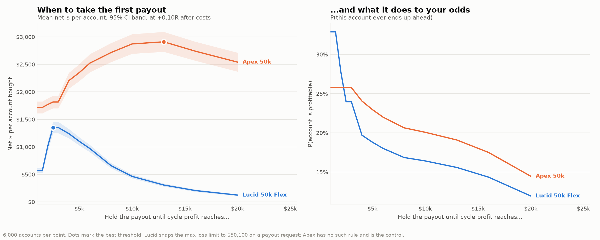

# 02 · Lucid 50k Flex vs the field

**Date:** 2026-08-22
**Reproduce:** `python run_edge_curve.py`, `python run_payout_timing.py`
**Market data used:** none.

---

## The one-line answer

**Lucid Flex is the best account here for *stability* and the worst for *upside*,
and the gap in both directions is large.** Since the goal is sustained stable
profit rather than maximum expected dollars, it is the right choice — but for a
reason opposite to the one a payout-size comparison would give.

---

## Why Lucid was expected to win, and where that was wrong

Going in, three of its rules look strictly better than Apex's: EOD trailing
instead of intraday, no consistency rule once funded, and no activation or
monthly fee. Two look worse: a payout capped at min(50% of cycle profit,
$2,000), and a 90/10 split instead of 100%.

The expectation was that the good rules would dominate. **They do not.** The
payout cap dominates everything else once you have any real edge.

### Mean net $ per account bought

| After-cost edge | Lucid Flex | Apex | TopStep | MFFU |
|---|---|---|---|---|
| 0.00R | $104 | $134 | $254 | $195 |
| +0.10R | $489 | $1,727 | $1,397 | $1,284 |
| +0.20R | $1,059 | $5,856 | $4,357 | $4,334 |
| +0.30R | $1,895 | $10,821 | $11,218 | $11,404 |
| +0.40R | $2,969 | $15,491 | $25,501 | $25,740 |

At +0.40R Lucid returns **one eighth** of what TopStep does. The mechanism,
measured directly at +0.40R:

| | $ per payout | payouts per account | gross |
|---|---|---|---|
| Lucid Flex | **$803** | 3.87 | $3,107 |
| Apex | $3,250 | 4.78 | $15,549 |
| TopStep | $3,639 | 6.96 | $25,319 |

Lucid takes *more frequent, far smaller* payouts. The $2,000 ceiling does not
scale with account performance the way Apex's and TopStep's uncapped
withdrawals do, so a good trader's upside is structurally clipped.

---

## Where Lucid actually wins: P(this account makes money)

| After-cost edge | **Lucid Flex** | Apex | TopStep | MFFU |
|---|---|---|---|---|
| −0.10R | **5.1%** | 1.8% | 2.3% | 1.7% |
| −0.05R | **9.1%** | 4.0% | 4.7% | 3.2% |
| 0.00R | **14.8%** | 8.3% | 8.6% | 6.6% |
| +0.10R | **33.1%** | 26.2% | 25.0% | 21.6% |
| +0.20R | **53.1%** | 49.8% | 44.8% | 42.9% |
| +0.30R | **71.4%** | 71.1% | 65.0% | 63.6% |
| +0.35R | 78.0% | **79.4%** | 73.4% | 72.5% |

**Lucid has the highest probability of profit at every edge level from −0.20R
through +0.30R** — the entire range anyone realistically occupies. Apex only
overtakes at +0.35R, an edge that would make the choice of firm academic.

At zero edge Lucid is at 14.8% against Apex's 8.3%: **nearly twice the chance
of getting anything back**. The same cap that clips the upside also means Lucid
hands you money earlier and more often, and the absence of a funded-stage
consistency rule and a safety-net buffer removes two gates that block Apex
accounts that are otherwise alive.

### The two break-even edges

| | Positive **mean** | Positive **median** (P(profit) > 50%) |
|---|---|---|
| **Lucid Flex** | −0.059R | **+0.185R** |
| Apex | −0.036R | +0.201R |
| TopStep | −0.107R | +0.225R |
| MFFU | −0.073R | +0.234R |

**Lucid needs the least edge of any of them to make a typical account
profitable** (+0.185R), and it is the first whose median turns positive as edge
rises. Its mean break-even is mid-pack precisely because the cap suppresses the
tail that a mean is made of.

Restating `findings/01`'s conclusion with the account now chosen: the target is
**+0.185R per trade after all costs**. At 2R targets that is a **39.5% win rate
after commission and slippage**, against 33.3% to break even.

---

## When to take the first payout

A payout request snaps Lucid's max loss limit up to $50,100 regardless of where
the trailing floor had reached. Taking $500 at $51,000 of equity leaves $400 of
room instead of $1,900, so "withdraw the moment you are allowed" is not
obviously right. Scanned at +0.10R, 6,000 accounts per point:

| Hold payout until cycle profit reaches | Lucid mean | Lucid P(profit) | Apex mean | Apex P(profit) |
|---|---|---|---|---|
| $1,000 (earliest possible) | $573 | **32.9%** | $1,718 | **25.8%** |
| $2,000 | $1,008 | 27.8% | $1,770 | 25.8% |
| **$2,500** | **$1,352** | 24.0% | $1,815 | 25.8% |
| $4,000 | $1,242 | 19.7% | $2,203 | 24.1% |
| $8,000 | $659 | 16.9% | $2,715 | 20.6% |
| **$13,000** | $306 | 15.6% | **$2,910** | 19.1% |
| $20,000 | $123 | 11.9% | $2,540 | 14.5% |

**The two objectives point in opposite directions, on both firms.** Waiting
concentrates value into fewer, larger payouts — which raises the mean and
lowers the chance that this particular account ever pays you anything.

- **Maximising the mean:** hold to **$2,500** on Lucid (2.4× better than
  withdrawing immediately). Lucid's optimum is interior and early because past
  $4,000 of cycle profit the 50% cap has already bound at $2,000 — waiting
  longer adds risk and buys no extra payout. Apex has no cap, so its curve keeps
  climbing to ~$13,000.
- **Maximising P(profit):** withdraw at the **earliest possible moment**, on
  both firms. Monotone, no interior optimum.

**For the stated goal — stable profit — withdraw as early as the rules allow.**
The floor snap is real and it does cost trading room, but it costs less than
leaving the money in an account that can still die.

---

## What this does not say

- **Not a claim Lucid is profitable.** Every number above still sits below the
  +0.185R bar unless the strategy clears it. The account choice moves the bar;
  it does not clear it.
- **The 90/10 split is modelled but is not the story.** Measured directly:
  setting the split to 100% and changing nothing else lifts Lucid's mean net
  by 13.8% at +0.10R and 11.5% at +0.40R, and leaves P(profit) unchanged to
  the decimal. Nowhere near an eightfold gap. The cap is the mechanism.
- **The rule numbers could be wrong.** Compiled from public pages in August
  2026; Lucid dropped ProjectX support in December 2025 and terms move. Verify
  against the account dashboard before committing money — in particular the
  post-payout floor snap and the exact cap, since those two drive this document.
- **Trader model is parametric.** Fixed R, IID trades, no volatility clustering,
  no behavioural response to drawdown. Every omission flatters the trader.

## Decision

Proceed on **Lucid 50k Flex**, for the stability profile and because it is the
only candidate that explicitly permits full automation (bots, EAs and copiers
allowed; HFT and hedging banned). Automation runs through **Rithmic or
Tradovate** — not ProjectX, which Lucid discontinued in December 2025.

Target for `research/`: **+0.185R per trade after costs**, ≈39.5% win rate at 2R.
